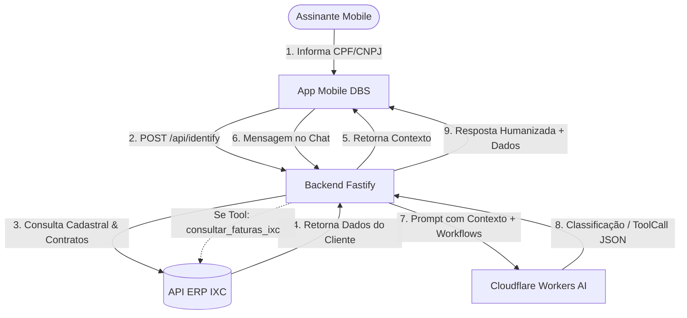

# DBS TELECOM — MVP Atendimento Inteligente Mobile & Backend

Solução desenvolvida para o **Desafio Técnico DBS TELECOM**, composta por um **Aplicativo Mobile (React Native / Expo)** e um **Backend API (Fastify / TypeScript)** integrado nativamente ao **ERP IXC** e à **Inteligência Artificial (Cloudflare Workers AI)**.

---

## 🚀 Visão Geral da Solução

O objetivo deste MVP é automatizar e humanizar a primeira linha de atendimento aos assinantes da **DBS TELECOM**:
1. **Identificação Instantânea**: Consulta os dados cadastrais do cliente no ERP IXC via CPF ou Novo CNPJ Alfanumérico.
2. **Atendimento Personalizado**: A IA recebe o contexto completo do cliente (nome, plano, status do contrato, débitos) e o chama pelo nome sem solicitar dados repetidos.
3. **Triagem Técnica N1 Obrigatória**: Diagnóstico passo a passo de conexão e lentidão antes de qualquer transferência para humano.
4. **Resolução Financeira Automatizada**: Localiza faturas em aberto no IXC e entrega a linha digitável, código PIX e link direto para pagamento.
5. **Qualificação Comercial**: Apresentação de planos com Wi-Fi 6 e contorno de objeções de vendas.

---

## 🛠️ Tecnologias Utilizadas e Justificativa

### Backend API
- **Node.js 24 (Native ESM & Strip Types)**: Execução nativa de TypeScript sem necessidade de etapa prévia de build (`--experimental-strip-types`), garantindo performance de ponta e startup instantâneo.
- **Fastify 5**: Framework web de altíssimo throughput, com baixo overhead de memória e suporte a schemas declarativos.
- **Zod 4 & Fastify Type Provider Zod**: Validação estrita de contratos de entrada e variáveis de ambiente com inferência estática de tipos.
- **Pino & Pino-Pretty**: Sistema de logging estruturado de alta performance com colorização, timestamps precisos e rastreamento de contexto.
- **Axios**: Cliente HTTP robusto com interceptors, timeouts e autenticação Basic para a API IXC.

### Inteligência Artificial & ERP
- **Cloudflare Workers AI (`qwen3-30b-a3b-fp8`)**: Modelo de linguagem de baixa latência e alta precisão para classificação e orquestração de tools JSON.
- **ERP IXC Soft**: Integração direta com os recursos `/cliente`, `/fn_areceber` e `/cliente_contrato`.

### Aplicativo Mobile
- **React Native 0.86 & React 19**: Interface responsiva, moderna e nativa para iOS, Android e Web.
- **Expo 57 & Expo Router**: Roteamento baseado em arquivos com transições fluidas entre telas.
- **Validador de Novo CNPJ Alfanumérico**: Compatibilidade com as novas regras da Receita Federal (Módulo 11 com tabela ASCII - 48).

---

## 📐 Arquitetura da Solução



---

## 📋 Demonstração dos 4 Fluxos do Desafio

### 1. Fluxo de Identificação
- **Ação**: O cliente digita seu CPF ou CNPJ (suporta novo padrão alfanumérico).
- **Processamento**: O backend consulta a base da IXC e retorna nome, status do contrato, plano ativo e débitos.
- **Resultado**: O app inicia o chat com a saudação personalizada: *"Olá, {Nome}! Sou o assistente virtual da DBS TELECOM. Como posso ajudar você hoje?"*.

### 2. Fluxo Comercial (Planos & Upgrade)
- **Cliente**: *"Quero contratar um plano de internet."*
- **IA**: Identifica a intenção como **COMERCIAL**, executa as etapas de qualificação (quantidade de dispositivos na residência) e apresenta as opções de planos com tecnologia Wi-Fi 6.

### 3. Fluxo de Suporte Técnico N1 (Lentidão / Queda)
- **Cliente**: *"Minha internet está muito lenta."*
- **IA**: Identifica como **SUPORTE** e conduz a triagem obrigatória de 5 etapas:
  1. *Verificação de escopo* (afeta um ou todos os aparelhos?).
  2. *Verificação de LEDs e luz LOS vermelha* (diagnóstico de rompimento de fibra).
  3. *Verificação de cabos de rede e energia*.
  4. *Ciclo de energia / reboot do modem* (desligar por 30 a 60 segundos).
  5. *Confirmação de desfecho* (se persistir, gera resumo detalhado e encaminha ao suporte humano).

### 4. Fluxo Financeiro (2ª Via de Boleto)
- **Cliente**: *"Preciso do meu boleto."*
- **IA**: Identifica a intenção **FINANCEIRA** e aciona a tool `consultar_faturas_ixc`.
- **Processamento**: O backend busca em tempo real na tabela `fn_areceber` da IXC e retorna o valor, vencimento, código de barras e link de pagamento.

---

## ⚙️ Instalação e Execução

### Pré-requisitos
- Node.js 24+ instalado (ou Docker)
- NPM 10+

### 1. Configuração do Backend

1. Acesse o diretório do backend:
```bash
cd DBS/backend
```

2. Crie o arquivo `.env` baseado no exemplo:
```env
PORT=3333

# IXC TELECOM
IXC_API_URL=https://demo.ixcsoft.com.br/webservice/v1
IXC_API_TOKEN=1c0e2d764be841d9b88b02414337d7bbc2dd4e1bb940295343b36d31cbaa9f98
IXC_API_USER=105

# INTELIGÊNCIA ARTIFICIAL
AI_API_KEY=cfut_Nu3u4D47hylcKifBa14O3FgxqCK1WCRacjkKSxnC0cdfcd0c
AI_MODEL=qwen3-30b-a3b-fp8
AI_URL_WORKER=https://api.cloudflare.com/client/v4/accounts/b1c1835d912edc289fe2ab63f7745094/ai/run/@cf/qwen/qwen3-30b-a3b-fp8
```

3. Instale as dependências:
```bash
npm install
```

4. Execute o servidor de desenvolvimento:
```bash
npm run dev
```
> O servidor estará rodando em `http://localhost:3333`.

---

### 2. Configuração do Aplicativo Mobile

1. Acesse o diretório do mobile:
```bash
cd DBS/mobile
```

2. Instale as dependências:
```bash
npm install
```

3. Inicie o Expo:
```bash
npm run start
```
- Pressione `w` no terminal para abrir no **Navegador Web**.
- Ou escaneie o QR Code com o app **Expo Go** no Android / iOS.

---

## 🔒 Segurança e Tratamento de Dados

- **Zero Credenciais no Client**: Nenhum token da IXC ou chave de IA é exposto no app mobile. Toda a comunicação trafega exclusivamente pelo backend.
- **Tratamento Global de Erros**: Middleware com sanitização de headers e mascaramento de campos sensíveis (senhas, tokens e payloads).
- **Validação Estrita Zod**: Sanitização automática de mensagens de erro para o usuário final em português claro.

---

## 🌟 Diferenciais Implementados

1. **Suporte ao Novo CNPJ Alfanumérico**: Validação algorítmica Módulo 11 completa com tabela ASCII - 48 e máscara em tempo real.
2. **Logs Profissionais Pino**: Formatação colorida, timestamps e separação de contexto por módulo.
3. **Badges Visuais de Departamento**: Indicação em tempo real no app para qual departamento o atendimento foi classificado.
4. **Session Manager com TTL**: Histórico multi-turno em memória para triagem conversacional fluida.
5. **Chips de Demonstração Rápida**: Botões interativos na tela de Chat para facilitar a apresentação dos 4 fluxos para a banca avaliadora.
