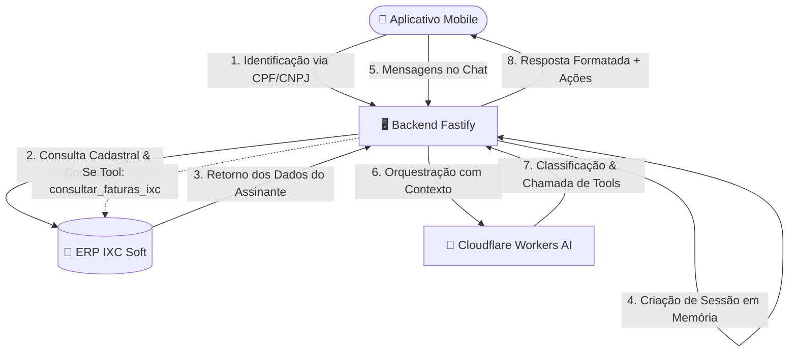

# DBS TELECOM — Atendimento Inteligente (Mobile & Backend)

Solução de atendimento ao cliente integrada ao **ERP IXC Soft** e à **Cloudflare Workers AI**, composta por um **Aplicativo Mobile (React Native / Expo)** e uma **API Backend (Fastify / TypeScript)**.

---

## 🛠️ Tecnologias Utilizadas

### Backend API
- **Node.js 24 (Native ESM & Strip Types)**: Execução nativa de TypeScript sem necessidade de transpilador em desenvolvimento, com inicialização instantânea e baixo consumo de recursos.
- **Fastify 5**: Framework web de alta performance com baixo overhead de memória.
- **Zod 4 & Fastify Type Provider**: Validação estrita de contratos de entrada e variáveis de ambiente com inferência de tipos em tempo de compilação.
- **Pino & Pino-Pretty**: Sistema de logging estruturado de alta performance.
- **Axios**: Cliente HTTP para comunicação com a API do ERP IXC.
- **Segurança**: `@fastify/helmet` para cabeçalhos HTTP defensivos e `@fastify/rate-limit` para proteção contra abusos de requisições.

### Inteligência Artificial
- **Cloudflare Workers AI (`@cf/qwen/qwen3-30b-a3b-fp8`)**: Processamento de linguagem natural, classificação de departamentos (**Comercial**, **Suporte**, **Financeiro**) e execução de ferramentas (*tool calling*) via JSON.

### Aplicativo Mobile
- **React Native 0.86 & Expo 57**: Interface moderna, fluida e multiplataforma (Android, iOS e Web).
- **Validador de Novo CNPJ Alfanumérico**: Compatibilidade com a nova regra de cálculo da Receita Federal (Módulo 11 com tabela ASCII - 48).
- **Design System DBS TELECOM**: Paleta oficial com Laranja Vibrante (`#F84B03`), Laranja Suave (`#FB8200`), Cinza Escuro (`#4B4C51`) e Fundo Branco (`#FFFFFF`).

---

## 📐 Arquitetura do Sistema



---

## 🔑 Obtenção e Configuração das Credenciais

Para executar o backend, é necessário configurar o arquivo `.env` na pasta `DBS/backend`. Abaixo está o passo a passo para obter cada credencial:

### 1. Cloudflare Workers AI
1. Crie uma conta gratuita no painel da Cloudflare: [dash.cloudflare.com](https://dash.cloudflare.com/).
2. No painel principal da sua conta, copie o **Account ID** (ID da Conta) exibido na visão geral.
3. Acesse o menu do seu perfil: **My Profile > API Tokens** (ou acesse [dash.cloudflare.com/profile/api-tokens](https://dash.cloudflare.com/profile/api-tokens)).
4. Clique em **Create Token**, selecione o template **Workers AI (Read and Edit)** ou crie um Custom Token com as permissões:
   - `Account` | `Workers AI` | `Edit`
   - `Account` | `Workers AI` | `Read`
5. Clique em **Create Token** e copie o **API Token** gerado.

### 2. ERP IXC Soft
1. Efetue login no painel administrativo do seu IXC Soft.
2. Navegue até **Configurações > Usuários > Usuários**.
3. Selecione ou crie um usuário de integração e acesse a aba **Permissões / WebService**.
4. Habilite a permissão de leitura (`Listar / Consultar`) nos recursos: `cliente`, `cliente_contrato` e `fn_areceber`.
5. Copie o **Token de WebService** e anote o **ID do usuário** (ex: `105`).

### 📄 Exemplo do Arquivo `DBS/backend/.env`
```env
PORT=3333

# Integração ERP IXC Soft
IXC_API_URL=https://seu-dominio.ixcsoft.com.br/webservice/v1
IXC_API_TOKEN=seu_token_webservice_ixc
IXC_API_USER=105

# Integração Cloudflare Workers AI
AI_API_KEY=seu_token_workers_ai_cloudflare
AI_MODEL=qwen3-30b-a3b-fp8
AI_URL_WORKER=https://api.cloudflare.com/client/v4/accounts/{seu_account_id}/ai/run/@cf/qwen/qwen3-30b-a3b-fp8
```

---

## 🔌 Endpoints da Integração IXC Soft

O backend consome a API REST oficial do IXC Soft utilizando autenticação `Basic Auth` com Token:

| Endpoint | Método | Descrição |
|---|:---:|---|
| `/webservice/v1/cliente` | `POST` | Consulta cadastral por CPF ou CNPJ (`cliente.cnpj_cpf`). |
| `/webservice/v1/cliente_contrato` | `POST` | Consulta contratos ativos e plano vinculado ao cliente. |
| `/webservice/v1/fn_areceber` | `POST` | Consulta faturas em aberto (`status = 'A'`) vinculadas ao `id_cliente`. |

---

## ⚙️ Instruções de Instalação e Execução

### Pré-requisitos
- Node.js 24+ ou Docker Desktop
- NPM 10+
- Aplicativo **Expo Go** instalado no celular (para testes nativos Android/iOS)

---

### Opção 1: Execução com Docker Compose

Para iniciar a API e a versão Web do Mobile de forma conteinerizada:

```bash
docker compose up -d --build
```

- **Backend Fastify**: `http://localhost:3333/health`
- **Mobile Web**: `http://localhost:80` ou `http://localhost:8080`

Para parar os serviços:
```bash
docker compose down
```

---

### Opção 2: Execução Local

#### 1. Iniciar o Backend
```bash
cd DBS/backend
cp .env.example .env
npm install
npm run dev
```
> O servidor estará rodando em `http://localhost:3333`.

#### 2. Iniciar o Mobile
Em outro terminal:
```bash
cd DBS/mobile
npm install
npm start
```
- Pressione `w` no terminal para abrir no navegador.
- Ou **escaneie o QR Code com o aplicativo Expo Go** no seu smartphone (Android ou iOS).

## 💬 Demonstração dos Fluxos

Ao abrir o aplicativo, clique em **"Iniciar Atendimento"** na tela inicial. Na tela de identificação, informe um CPF ou CNPJ cadastrado na IXC (ou utilize os atalhos de demonstração rápida disponíveis na tela). Após a identificação, o chat será aberto com uma saudação personalizada pelo nome do cliente.

Abaixo estão exemplos de mensagens que podem ser enviadas no chat para acionar cada fluxo:

### Fluxo 1 — Identificação
- O sistema consulta automaticamente a IXC ao informar o documento na tela de identificação.
- O chat inicia chamando o cliente pelo nome, sem solicitar dados já disponíveis no ERP.

### Fluxo 2 — Comercial
Mensagens de exemplo:
- `Quero contratar um plano de internet`
- `Quero uma internet mais rápida`
- `Quais planos vocês têm?`

O sistema identifica a intenção como **Comercial**, realiza a qualificação consultiva e apresenta opções de planos.

### Fluxo 3 — Suporte Técnico (Lentidão / Queda)
Mensagens de exemplo:
- `Minha internet está muito lenta`
- `A internet caiu`
- `Não estou conseguindo acessar nada`

O sistema identifica como **Suporte** e conduz a triagem técnica N1: verificação de escopo, luzes do modem, cabos, reinicialização do equipamento e, se necessário, encaminhamento para atendimento humano.

### Fluxo 4 — Financeiro (Boleto / 2ª Via)
Mensagens de exemplo:
- `Preciso do meu boleto`
- `Manda a chave pix da minha fatura`
- `Quero a segunda via`

O sistema identifica como **Financeiro**, consulta as faturas em aberto na IXC e exibe os dados de pagamento (valor, vencimento, linha digitável e link do boleto) diretamente no chat.

---

## 📦 Geração do APK Android (EAS Build)

Para compilar e gerar o arquivo `.apk` utilizando os servidores gratuitos do Expo (EAS Build):

1. **Criar conta no Expo**: Acesse [expo.dev](https://expo.dev/) e clique em **Sign Up** para criar sua conta gratuita. É essa plataforma que vai compilar o aplicativo na nuvem.

2. **Instalar o EAS CLI**: O EAS CLI faz a ponte entre o seu computador e os servidores do Expo. No terminal, instale globalmente:
   ```bash
   npm install -g eas-cli
   ```

3. **Fazer Login**: Autentique sua máquina com a conta que você criou:
   ```bash
   eas login
   ```

4. **Inicializar o projeto**: Navegue até a pasta do aplicativo (`cd DBS/mobile`) e rode o comando de configuração para gerar o arquivo `eas.json`:
   ```bash
   eas build:configure
   ```

5. **Configurar o `eas.json` para gerar `.apk` e definir variáveis de ambiente**: Abra o arquivo `eas.json` criado na pasta do mobile e substitua o conteúdo pelo bloco abaixo. Isso garante que o build seja gerado em `.apk` e que o app consuma a API de produção:
   ```json
   {
     "cli": {
       "version": ">= 22.2.0",
       "appVersionSource": "remote"
     },
     "build": {
       "development": {
         "developmentClient": true,
         "distribution": "internal"
       },
       "preview": {
         "distribution": "internal",
         "android": {
           "buildType": "apk"
         },
         "env": {
           "EXPO_PUBLIC_API_URL": "URL-DA-API-DE-PRODUCAO",
           "EXPO_PUBLIC_NODE_ENV": "prod"
         }
       },
       "production": {
         "autoIncrement": true,
         "env": {
           "EXPO_PUBLIC_API_URL": "URL-DA-API-DE-PRODUCAO",
           "EXPO_PUBLIC_NODE_ENV": "prod"
         }
       }
     },
     "submit": {
       "production": {}
     }
   }
   ```
   > Substitua `URL-DA-API-DE-PRODUCAO` pela URL do backend hospedado na nuvem (ex: `https://api-dbs.suaempresa.com.br`).

6. **Disparar a Build**: Com tudo configurado, envie para a nuvem:
   ```bash
   eas build -p android --profile preview
   ```
   Caso encontre problemas com cache de versões anteriores:
   ```bash
   eas build -p android --profile preview --clear-cache
   ```
   > Aguarde alguns minutos. Ao fim do processo, o terminal fornecerá o link direto para download do arquivo `.apk` pronto para instalar no Android.

